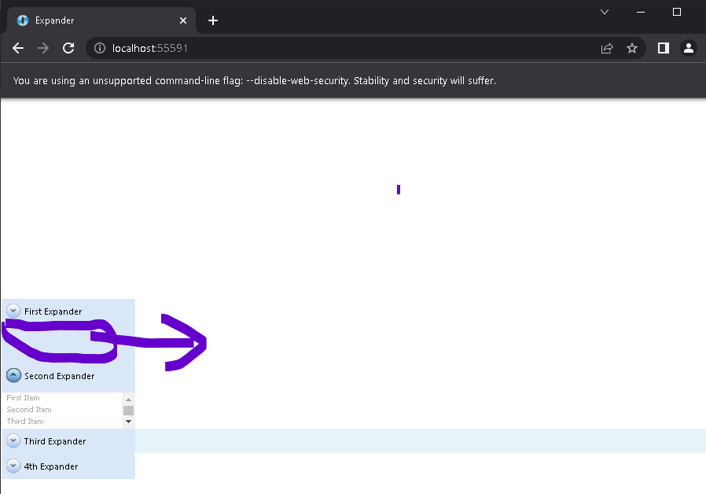

# ExpanderBug

There are n expanders with styles. Like in the Silverlight version when the second one is clicked. The other visible one should be collapsed. This repo should be run like accordion menu. But in the OpenSilver somehow the collapse behaviour doesn't work as expected and it works like a hide behaviour. So this could be a bug.

## Silverlight Behaviour

## Open Silver Behaviour

